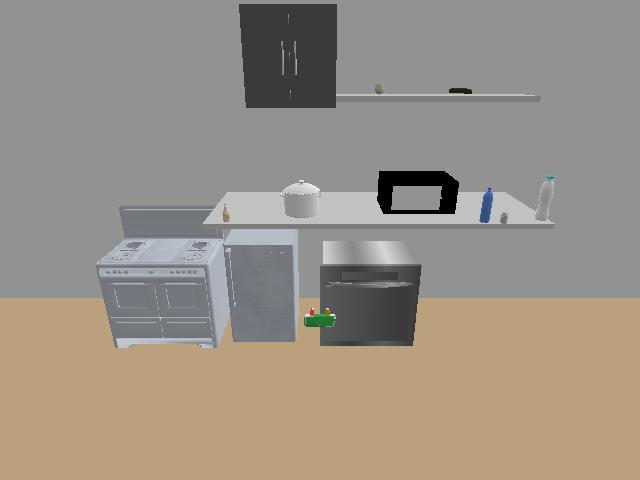

# GPT4 Image Recognition API

Small tool using selenium to get a temporary API endpoint for the ChatGPT Image Input / image recognition feature.
Very quickly made, you should not rely on this on prod.
Should be deprecated as soon as we have access to official OpenAI endpoints.
Works with google authentification. If you use a different login method, please modify the code for your usecase.

# Requirements

- python >= 3.9
- Chrome version is 118.xx.xx (if you want to update the chrome version on Ubuntu, download the .deb file at [Chrome home page](https://www.google.com/chrome/?brand=QCTP&gclid=CjwKCAiA1fqrBhA1EiwAMU5m_y7fWrl9VUJc4rVTsMj-yKvU7m8IcPhykYEeDlZ0NOexy5haa-FG6RoCfFcQAvD_BwE&gclsrc=aw.ds) and run `sudo dpkg -i google-chrome-stable_current_amd64.deb`)
- A paid OpenAI API associated with a Google account

# Installation

- Create venv, then clone the repo
- Install requirements:
`pip install -r requirements.txt`
- Define a `.env` file with your OpenAI Google credentials (or whatever but make sure to modiy the code appropriately), for example,
```
GOOGLE_EMAIL={GOODLE.ACCOUNT}@gmail.com
GOOGLE_PASSWORD={PASSWORD}
```

# Usage

- Run FastAPI server in one terminal window. You'll see a Chrome window pop up
`python main.py`
- Open another Chrome window and go to https://0.0.0.0:8000/start
- In the first Chrome window, you'll see ChatGPT being automaticly logged in. Manually click "Ok, let's go"
- In the first terminal window, press ENTER
- Run example queries in another terminal window
`python query.py`
- Or try multiple queries in Jupyter notebook `query.ipynb`


# Endpoints

## GET
`https://0.0.0.0:8000/start`
Start a new session. Complete manually the login steps and press enter when asked.
Wait for the OpenAI popup to display before pressing enter.

`https://0.0.0.0:8000/stop`
Stop the current session.

## POST
`https://0.0.0.0:8000/action/`
Post a local image path with a prompt, or continue the conversation without image, or continue the conversation with a new image. Example:

`images/observation_0.jpg`            |  `images/observation_29.jpg`
:-------------------------:|:-------------------------:
  |  


```
Request:
{
    "image_path": "images/observation_0.jpg",
    "prompt": "Describe in a list all objects in this image.",
    "continue_chat": False
}

Response:
{
    "status": "Success",
    "result": {
        "answer": ['wall cabinet', 'shelf', 'stove', 'tea kettle', 'microwave', 'trash can', 'refrigerator', 'spice container', 'salt shaker', 'bottle', 'dishwashing liquid', 'vase', 'plant']
    }
}
Request:
{
    "image_path": "None",
    "prompt": "Is the door of the refrigerator open?",
    "continue_chat": True
}

Response:
{
    "status": "Success",
    "result": {
        "answer": "no"
    }
}
Request:
{
    "image_path": "images/observation_29.jpg",
    "prompt": "Is the door of the refrigerator open?",
    "continue_chat": True
}

Response:
{
    "status": "Success",
    "result": {
        "answer": "yes"
    }
}
```
